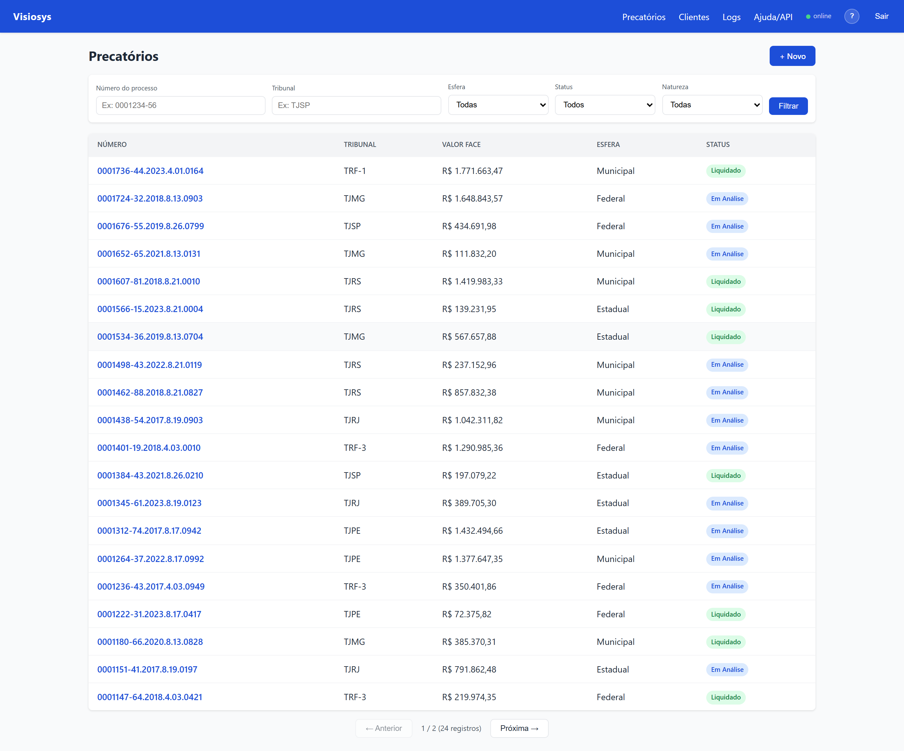
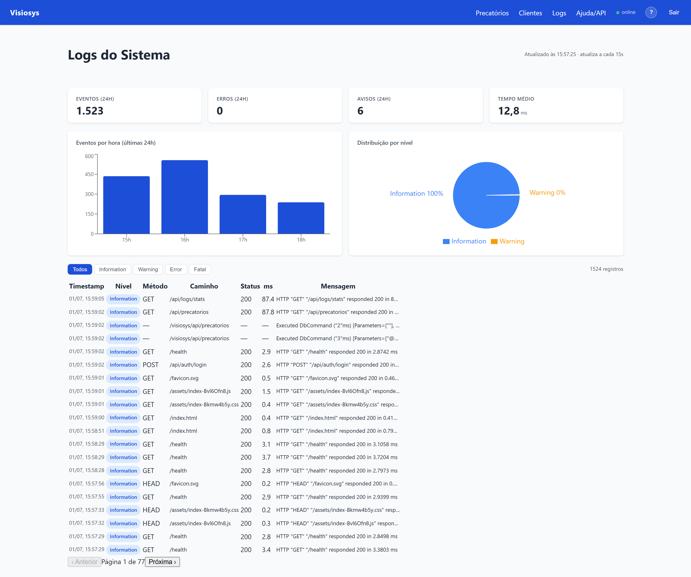
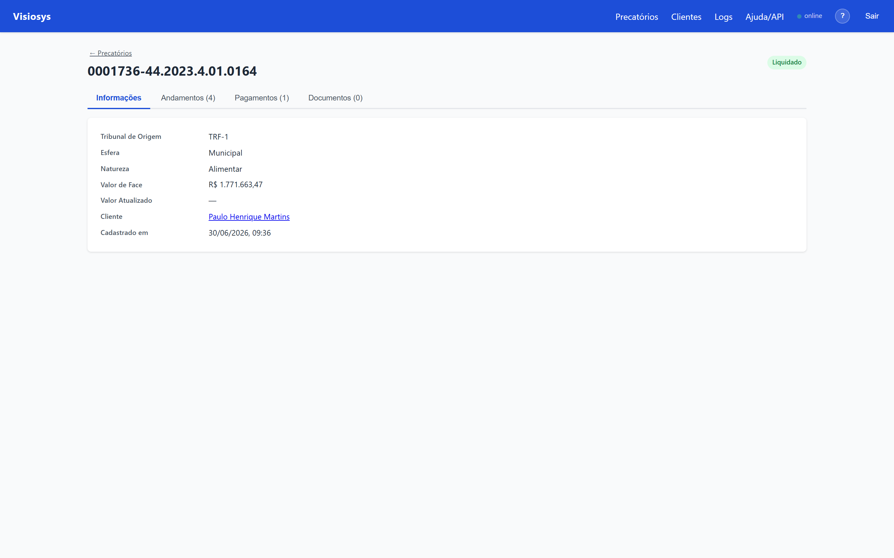
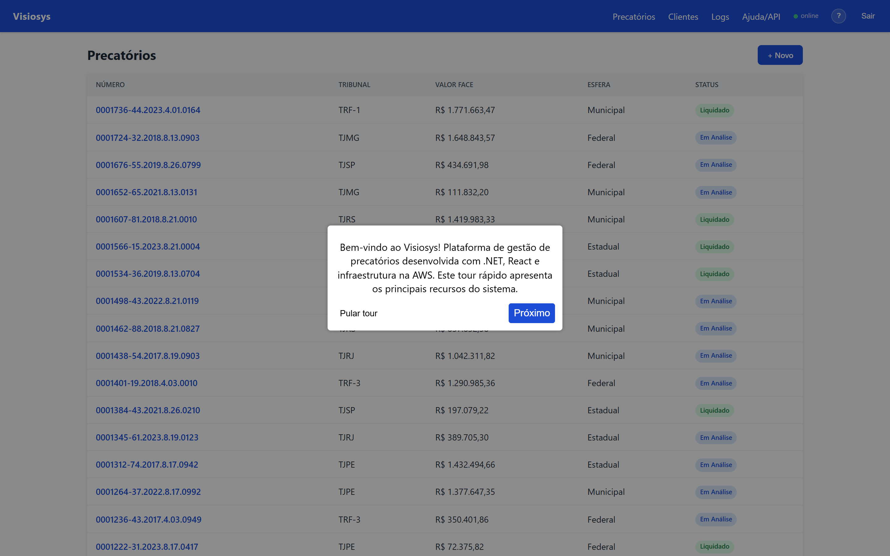

# Visiosys: Sistema de Gestão e Assessoria de Precatórios

> Projeto de estudos aplicados, construído para colocar em prática, num cenário de negócio realista e com infraestrutura real na AWS, fundamentos de arquitetura de sistemas e engenharia de software estudados ao longo dos últimos 4 anos: Domain-Driven Design, TDD, persistência poliglota, infraestrutura como código e deploy seguro em nuvem.

[](https://github.com/felnixnix/visiosys/actions/workflows/ci.yml)
[](https://github.com/felnixnix/visiosys/actions/workflows/deploy.yml)
[](https://felipedearaujo.dev/visiosys)

**Demo ao vivo:** https://felipedearaujo.dev/visiosys — acesso demo: `user` / `user`

---

## Demonstração

<table>
  <tr>
    <td width="50%"><b>Lista de precatórios</b><br/></td>
    <td width="50%"><b>Dashboard de observabilidade</b><br/></td>
  </tr>
  <tr>
    <td width="50%"><b>Detalhe do precatório</b><br/></td>
    <td width="50%"><b>Tour guiado embutido</b><br/></td>
  </tr>
</table>

---

## Sobre o projeto

O Visiosys não é um CRM. Apesar de ter um cadastro de clientes e um histórico de interações, características que lembram um CRM, a entidade central do sistema não é o cliente, e sim o **precatório**: o ativo judicial cujo ciclo de vida (captação, análise, deságio, liquidação) o sistema gerencia de ponta a ponta. O cliente (credor) é uma entidade associada a esse ativo, não o produto final do sistema.

A categoria mais precisa é a de uma **plataforma vertical de gestão de ativos judiciais** (LegalTech), combinando elementos de gestão de recebíveis, document management (upload/armazenamento de documentos jurídicos) e auditoria/compliance (trilha LGPD).

## O que o projeto faz

Um **precatório** é uma dívida judicial que o poder público deve pagar a um credor, mas que normalmente leva anos para ser quitada pela fila oficial. Assessorias compram esse direito do credor por um valor menor (deságio), antecipando o dinheiro para ele e assumindo o risco de esperar o pagamento integral.

O Visiosys digitaliza esse fluxo de ponta a ponta:

- **Cadastro de credores** (pessoa física ou jurídica, com validação de CPF/CNPJ).
- **Registro do precatório** (tribunal de origem, esfera, natureza, valor de face).
- **Histórico de andamentos**: linha do tempo imutável de contatos, documentos recebidos e propostas.
- **Cálculo de deságio e liquidação**: registro do pagamento ao credor com o valor efetivamente pago.
- **Upload de documentos** (procurações, certidões) armazenados fora do servidor, em object storage.
- **Captura automática de andamentos** via Worker em background, com tolerância a falhas de fontes externas instáveis.
- **Trilha de auditoria**: todo acesso ou alteração a dado sensível é registrado para conformidade com a LGPD.

Está implantado e rodando em uma instância AWS real (não é só `localhost`); veja a [seção de produção](#ambiente-em-produção).

---

## Tecnologias usadas

| Camada | Tecnologia |
|---|---|
| Backend | C# / .NET 8, ASP.NET Core Web API, Swagger/OpenAPI |
| Domínio | Domain-Driven Design, modelos ricos, sem entidades anêmicas |
| Persistência relacional | PostgreSQL + Entity Framework Core (concorrência otimista via `xmin`) |
| Persistência documental | MongoDB (trilha de auditoria LGPD) |
| Armazenamento de arquivos | AWS S3 |
| Background jobs | .NET `BackgroundService` + `Microsoft.Extensions.Http.Resilience` (retry, backoff, circuit breaker) |
| Autenticação | JWT Bearer + Rate Limiting nativo do .NET 8 |
| Observabilidade | Serilog → Seq + MongoDB (logs estruturados, com dashboard de observabilidade no próprio sistema) |
| Frontend | React 19 + TypeScript + Vite + React Router |
| Ambiente local | Docker + Docker Compose (PostgreSQL, MongoDB e Seq para desenvolvimento) |
| Testes | xUnit + Testcontainers (PostgreSQL/MongoDB reais em container, não mocks) |
| Infraestrutura | Terraform (IaC), EC2 ARM Graviton2, RDS PostgreSQL, S3, Route 53, nginx (reverse proxy), Let's Encrypt/certbot (TLS) |
| Validação pré-push | Hook `pre-push` valida cada push localmente (build Release + testes de domínio, ~30s) antes de chegar ao GitHub; simulação completa do pipeline de CI sob demanda via [act](https://github.com/nektos/act). Ver [ADR-024](docs/adr/ADR-024-ci-local-act.md) |
| CI/CD | GitHub Actions: build, testes e deploy via AWS SSM com autenticação OIDC (sem chaves AWS estáticas, sem porta SSH aberta para o CI) |

Decisão deliberada: priorizar recursos **nativos** do ecossistema .NET (rate limiting, resiliência HTTP, health checks) em vez de bibliotecas de terceiros, sempre que o nativo resolve sem perda de robustez.

---

## Arquitetura

```
src/
├── Visiosys.Domain          # Entidades ricas, regras de negócio, sem dependências externas
├── Visiosys.Application     # Casos de uso (orquestram domínio + repositórios)
├── Visiosys.Infrastructure  # EF Core, repositórios, MongoDB, S3
├── Visiosys.Api             # Controllers, autenticação, composição (DI)
├── Visiosys.Worker          # BackgroundService de captura automática
└── Visiosys.Frontend        # SPA React + TypeScript
```

Persistência **poliglota** por design: PostgreSQL guarda o que precisa de consistência transacional (precatórios, pagamentos), MongoDB guarda o histórico de auditoria (mais flexível, append-heavy) e S3 guarda os arquivos binários. Nenhum deles tenta fazer o trabalho do outro.

As decisões arquiteturais relevantes (e as alternativas descartadas) estão registradas como **Architecture Decision Records** em [`docs/adr/`](docs/adr/): atualmente 27 ADRs, desde a escolha de DDD até os trade-offs deliberados de MVP.

---

## Como rodar o projeto localmente

### Pré-requisitos
- [.NET 8 SDK](https://dotnet.microsoft.com/download/dotnet/8.0)
- [Node.js 20+](https://nodejs.org/)
- [Docker](https://www.docker.com/) (para PostgreSQL, MongoDB e Seq locais)

### 1. Subir a infraestrutura local
```bash
cp .env.example .env   # preencha com valores locais (não use senhas reais)
docker compose up -d
```
Isso sobe PostgreSQL (`localhost:5432`), MongoDB (`localhost:27017`) e Seq (`localhost:8081`).

### 2. Rodar a API
```bash
cd src/Visiosys.Api
dotnet run
```
A API aplica as migrations do banco automaticamente na inicialização. Por padrão sobe em `http://localhost:5000`. A documentação interativa fica em `/swagger` (liberada sem autenticação em ambiente de desenvolvimento).

### 3. Rodar o Worker (opcional, captura em background)
```bash
cd src/Visiosys.Worker
dotnet run
```

### 4. Rodar o frontend
```bash
cd src/Visiosys.Frontend
npm install
npm run dev
```
SPA disponível em `http://localhost:5173`, consumindo a API local.

### Rodar os testes
```bash
dotnet test
```
Os testes de integração sobem PostgreSQL e MongoDB reais via Testcontainers (não usam mocks de banco), então é necessário ter o Docker rodando.

### Validação local antes do push

O repositório inclui um hook `pre-push` que executa `dotnet build --configuration Release` + testes unitários de domínio automaticamente antes de cada `git push` (~30s, sem Docker).

**Configuração inicial (uma vez após clonar):**
```bash
bash scripts/setup-dev.sh
```

Isso configura o `core.hooksPath` do git para `.githooks/`.

Para simulação completa do CI (build + testes de integração com Testcontainers, via [act](https://github.com/nektos/act)):
```bash
bash scripts/validate-ci.sh
```

Para pular a validação em um push específico: `git push --no-verify`

A estratégia em duas camadas (hook rápido no push + simulação completa sob demanda) está documentada no [ADR-024](docs/adr/ADR-024-ci-local-act.md).

---

## Ambiente em produção

A aplicação está disponível publicamente em **https://felipedearaujo.dev/visiosys** (HTTPS com certificado Let's Encrypt), implantada na AWS (EC2 ARM Graviton2 + RDS PostgreSQL gerenciado) e provisionada inteiramente via Terraform. O deploy acontece automaticamente a cada push em `main`. O ambiente é populado com dados realistas (mock) através de um [seeder versionado](infra/scripts/seed.py) que passa pelas regras de negócio reais da API, não por inserção direta no banco.

---

## Desafios técnicos resolvidos

Uma seleção de problemas reais enfrentados ao levar o projeto da máquina local para produção:

- **Deploy sem porta SSH exposta:** os runners do GitHub Actions usam IPs dinâmicos, incompatíveis com um Security Group restrito por IP fixo. Solução: deploy via **AWS SSM `send-command`** (sem porta de entrada nova) autenticado por **OIDC** (credenciais AWS temporárias por execução, sem chave estática no GitHub). Ver [ADR-021](docs/adr/ADR-021-deploy-ssm-oidc.md).
- **Migrations em banco privado:** o RDS fica em sub-rede privada, sem acesso externo direto. Solução: `Database.Migrate()` idempotente executado no startup da API, tornando cada deploy self-contained.
- **Concorrência otimista:** dois operadores editando o mesmo precatório simultaneamente não podem se sobrescrever silenciosamente. Resolvido com controle de versão via `xmin` do PostgreSQL através do EF Core, lançando `DbUpdateConcurrencyException` em conflitos.
- **Publish single-file quebrando o Serilog:** o modo `PublishSingleFile` do .NET impede a descoberta automática de assemblies de sink do Serilog via configuração, derrubando o serviço em produção. Resolvido declarando explicitamente os sinks usados em `Serilog:Using` no `appsettings.json`.
- **Sink de log em conflito de versão (single-file):** a dashboard de observabilidade grava logs no MongoDB, mas o pacote `Serilog.Sinks.MongoDB` era compilado contra uma versão do `MongoDB.Driver` diferente da usada pela aplicação. Como no single-file há um único driver empacotado, a invocação do sink por reflection falhava no startup e derrubava a API em crash-loop — mascarado por um `catch` que saía com código 0. Resolvido com um **sink próprio** na camada Infrastructure, que usa o mesmo driver da aplicação e é configurado em código (sem reflection), e fazendo o startup relançar a exceção para falhas ficarem visíveis. Ver [ADR-025](docs/adr/ADR-025-sink-mongodb-proprio.md).
- **Contrato de API vs. frontend:** enums trafegavam como inteiros por padrão no `System.Text.Json`, quebrando o frontend que espera/envia strings. Resolvido com `JsonStringEnumConverter` global, aceitando ambos os formatos na entrada.
- **Exposição segura da documentação da API:** o Swagger só existia em desenvolvimento. Liberá-lo em produção sem proteção exporia o contrato completo da API publicamente. Resolvido com Basic Auth reaproveitando a credencial administrativa já existente, sem novo segredo a gerenciar (ver [ADR-022](docs/adr/ADR-022-swagger-producao-basic-auth.md)). Como é um projeto de portfólio, o acesso foi depois estendido também à conta de demonstração, para que quem explora o sistema pela conta demo alcance a documentação (ver [ADR-026](docs/adr/ADR-026-swagger-acesso-usuario-demo.md)).
- **Domínio público com path base e roteamento correto:** servir a aplicação em `felipedearaujo.dev/visiosys` (path, não subdomínio) exigiu alinhar três camadas: `app.UsePathBase("/visiosys")` no backend, `base: '/visiosys/'` no Vite e `basename={import.meta.env.BASE_URL}` no React Router. O ponto não óbvio: o ASP.NET Core insere o roteamento implicitamente antes do `UsePathBase` quando `UseRouting()` não é chamado de forma explícita, fazendo as rotas do backend nunca casarem com requisições prefixadas. Ver [ADR-023](docs/adr/ADR-023-dominio-felipedearaujo-dev.md).

---

## Documentação

- [`docs/AUTORIA.md`](docs/AUTORIA.md): como o projeto foi construído, autoria das decisões e uso de IA como copiloto (com autoavaliação técnica).
- [`docs/adr/`](docs/adr/): Architecture Decision Records (contexto, decisão, alternativas, consequências de cada escolha relevante).
- [`.ia/roteiro_desenvolvimento.md`](.ia/roteiro_desenvolvimento.md): roteiro de desenvolvimento por fases (walking skeleton até produção).
- [`.ia/README_ARQUITETURA.md`](.ia/README_ARQUITETURA.md): racional arquitetural e jornada de engenharia.
- [`.ia/arquitetura_sistema_precatorios_completo.md`](.ia/arquitetura_sistema_precatorios_completo.md): especificação completa de requisitos funcionais e não funcionais.

---

## Autor

**Felipe de Araújo**, Software Developer
